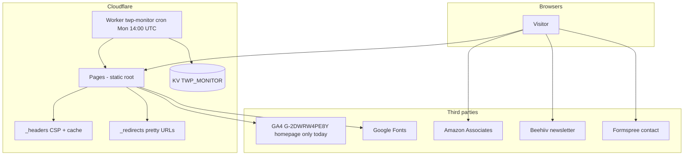
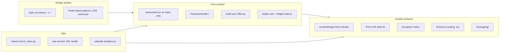
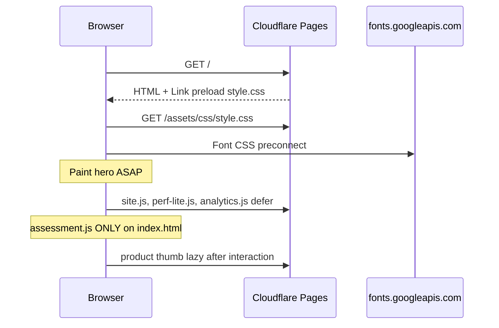
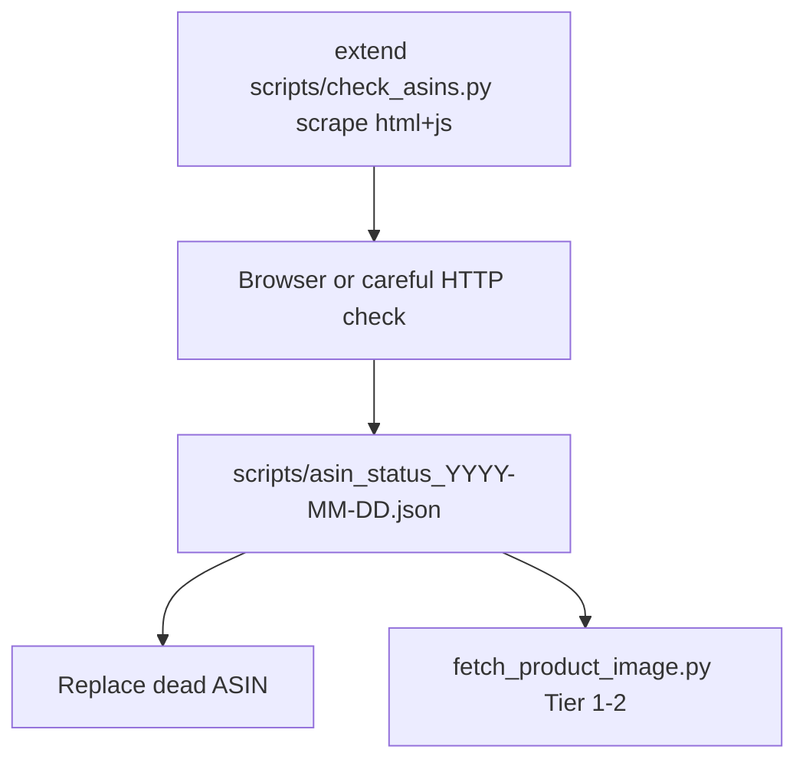
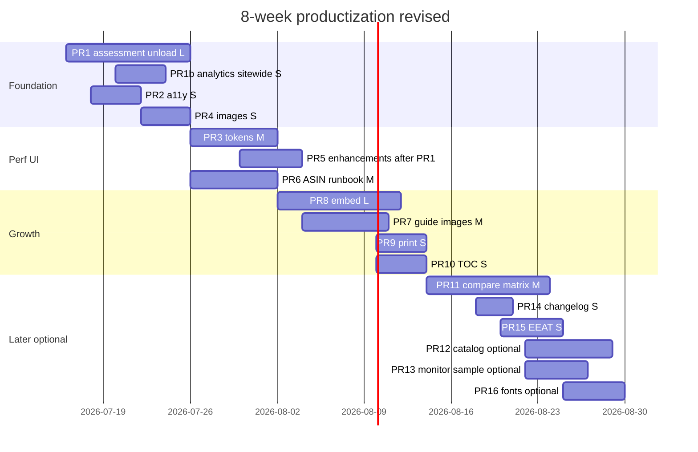

# The Workspace Pro — 4–8 Week Productization Design

| Field | Value |
|--------|--------|
| **Document** | Next 4–8 weeks productization & polish architecture |
| **Author** | _(design session)_ |
| **Date** | 2026-07-15 |
| **Status** | Draft (rev 3 — CF headers detach + analytics de-dupe) |
| **Canonical codebase** | `/home/cameron/.openclaw/workspace/theworkspacepro-v2` |
| **Live site** | https://www.theworkspacepro.com |
| **GitHub** | blasscameron-oss/theworkspacepro |
| **Hosting** | Cloudflare Pages (static) + optional Worker `twp-monitor` |

---

## Overview

The Workspace Pro is a static, honesty-first ergonomic / home-office content site whose **core product** is a free 6-step workspace assessment on the homepage, supported by calculators, Build Your Office, research guides, and Amazon Associates (`workspacepro-20`). Recent sessions fixed structural bugs (broken footers, dead ASINs), unified navigation, removed fabricated social proof, and shipped shareable quiz results, performance basics, and monitor hardening.

This design covers the **next 4–8 weeks of incremental productization**: (1) UI/UX and design-system consistency, (2) Core Web Vitals / speed, (3) traffic-driving features that stay within brand guardrails, (4) affiliate ASIN + product image ops, and (5) a shippable PR plan for Finch/implementers. The stack remains **static HTML/CSS/vanilla JS** on Cloudflare Pages—no SPA rewrite unless a later review proves a tool cannot be delivered otherwise.

**Assumed capacity:** one implementer (Finch-style), Cloudflare Pages preview deploys available, no Amazon Product Advertising API keys, Worker deploy optional (static site ships independently). External systems (Beehiiv, Formspree, GA4, Amazon Associates) are referenced from the tree only; account access is an operator concern outside this design.

---

## Background & Motivation

### Current architecture (production)



There is **no app server, D1, or server-side session**. All interactivity is client-side:

| Surface | Files | Role |
|---------|--------|------|
| Homepage + quiz | `index.html`, `assets/js/assessment.js` | Core product: 6 steps → persona, recs, checklist, share URL `/#assessment&r=` |
| Tools hub | `tools.html` → `/tools/` | Discovery for assessment, BYO, calculators (`tools.html` already omits `assessment.js`) |
| Build Your Office | `build-your-office.html`, `build-your-office.js` | Budget planner with product DB |
| Calculators | `ergonomic-height-calculator.html`, `workspace-setup-calculator.html` | Evergreen SEO tools (`.ehc-*` classes on height calc) |
| Guides | `guides/*.html` (16), `guides.html` | Long-form SEO + affiliate CTAs; many already have static `<nav class="toc">` |
| Compare | `compare/*.html` (3) | Head-to-head SERP pages (in sitemap/monitor; under-linked from tools hub) |
| Chrome | `assets/js/site.js` | Theme + mobile menu + active nav |
| Polish | `enhancements.js`, `bold.js`, `perf-lite.js` | Counters, progress, deals rotation, prefetch/lazy |
| Affiliate helper | `review-injector.js` | Tag rewrite + `rel=sponsored` only (no fake stars) |
| Design system | `assets/css/style.css` (~1.9k LOC), `bold.css` (~0.9k LOC) | Tokens `--c-*`, components — checklist below is non-exhaustive; CSS is canonical |
| Ops | `worker/monitor.js`, `scripts/check_asins.py`, `scripts/*asin*`, `scripts/affiliate_fix_*.json` | Health + ASIN audits |

### Pain points after the honesty/fix pass

1. **Design drift** — Guides use fallback tokens (`--color-border` vs design tokens `--c-border`); assessment results use classes for most structure but the **Estimated Total** block in `showResults()` is heavy inline styles; footer/nav duplicated across ~30 HTML files.
2. **JS payload waste** — **`assessment.js` is included in 33 HTML files** (all guides, all compare pages, BYO, calculators, legal/about, etc.) even though init **no-ops** unless `id="assessment"` is present (`assessment.js` DOMContentLoaded gate). Only `index.html` needs the script. `tools.html` already correctly omits it. `enhancements.js` is ~44 KB with features not used on every page.
3. **Analytics gap** — GA4 `G-2DWRW4PE8Y` ships **only on `index.html`**. Events in `assessment.js` guard on `typeof gtag`, so they only fire on home. Cross-page events are impossible until GA4 (or a shared snippet) is sitewide.
4. **Image / affiliate coverage** — Quiz/BYO Amazon thumbs are covered (23/23 local JPGs). **~66 of ~111 HTML-referenced ASINs lack local product images**. `og-default.jpg` is ~113 KB (largest single image).
5. **SEO surface incomplete** — `sitemap.xml` lastmods largely stuck at 2026-06-26 (`/tools/` is 2026-07-15); compare not on tools hub; no embeddable tools; guide TOC sticky polish incomplete (static TOCs already exist on several guides).
6. **Ops is manual** — ASIN verification is agent-browser + JSON logs; monitor does URL status only.
7. **Brand risk residual** — `bold.js` deal rotation uses hardcoded badges/prices; default this cycle is **static featured research / remove price theater** unless real dated deals exist.

### Why productize now

Traffic growth depends on **shareable tools + CWV + live affiliate paths**, not content volume alone. The site already has the right spine (quiz share, tools hub, honest “How We Work”). The next window should **compound quality and distribution** without rewriting the stack.

---

## Goals & Non-Goals

### Goals (4–8 weeks)

1. **Visual/UX consistency** — Single token set, consistent component patterns, mobile-first polish on quiz + tools + top guides.
2. **Core Web Vitals** — Mobile LCP **&lt; 2.5s**, CLS **&lt; 0.1**, INP **&lt; 200ms** on `/`, `/tools/`, top 5 guides (Search Console / CF Web Analytics as source of truth).
3. **Traffic features** — At least two shippable “cool” surfaces: embeddable height calculator + branded printable desk-fit output; compare hub at **`/compare/`**; sticky/enhance guide TOCs.
4. **Affiliate health** — Documented monthly ASIN runbook (source of truth); local image coverage for Tier 1–2 products; optional soft Worker sampling only.
5. **Shippable PRs** — Ordered, independently mergeable PRs with acceptance checks; realistic effort tags (S/M/L).

### Lightweight KPIs (track even without perfect baselines)

| KPI | How | Directional target (8 weeks) |
|-----|-----|------------------------------|
| Quiz completions | GA4 `assessment_complete` (home; sitewide GA after PR-analytics) | Week-over-week non-decreasing; log baseline week 1 |
| Shares | GA4 `assessment_share` | ≥ 5% of completes that use Share (directional) |
| Outbound sponsored clicks | GA4 `affiliate_click` once sitewide | Visible in GA after analytics PR; correlate with Amazon reports |
| Organic tool demand | GSC clicks/impressions for `/tools/`, height calc, setup calc | Non-decreasing impressions for calculators |
| CWV | GSC / CF Web Analytics | Meet LCP/CLS/INP targets on key URLs |
| Embed adoption | GA4 `embed_height_calc` + UTM on embed links | Any non-zero after ship = success for v1 |

Baselines: capture week-1 numbers after sitewide analytics lands; do not invent pre-period stats.

### Non-goals

- React/Vue/Svelte SPA rewrite or Next.js migration.
- Product lab, fabricated reviews, invented sale badges, or fake testimonials.
- Live Amazon Product Advertising API pricing.
- User accounts, comments, or server-side personalization.
- Replacing Beehiiv/Formspree with custom backends.
- Full redesign of brand identity.
- Aggressive automated Amazon crawling as authoritative availability (legal/ToS uncertified here).

### Brand guardrails (hard constraints)

- No fake testimonials or star widgets.
- Prices labeled approximate; “check live price” copy retained.
- Affiliate disclosure + medical disclaimers remain.
- Honest about not running a product lab (`How We Work`, research badge in `review-injector.js`).

---

## Proposed Design

### North-star architecture for the next phase



Work is organized into **five workstreams** mapping to the [PR Plan](#pr-plan).

---

### Workstream A — Design system & UI/UX polish

**Problem:** Two CSS layers (`style.css` + `bold.css`), guide pages with non-token CSS variables, duplicated chrome, one heavy inline block in assessment results.

**Approach:**

1. **Token authority** — `assets/css/style.css` `:root` and `[data-theme="dark"]` remain the single source of truth (`--c-bg`, `--c-primary`, `--space-*`, `--radius*`, `--font-*`).  
   - Migrate guide inline FAQ/TOC styles from `--color-*` fallbacks to `--c-*`.  
   - In `showResults()` (`assessment.js`), most markup already uses classes (`.result-hero`, `.recommendation`, etc.). **PR3 scope is narrow:** extract classes for the **Estimated Total** block (~lines 660–664) and any remaining one-off inline layout—not a full results rewrite.

2. **Component checklist (prefer when touching UI — not exhaustive)**

   Canonical map lives in **`assets/css/style.css`** (+ `bold.css` for v3 flourishes). When editing UI, prefer:

   | Component | Canonical classes | Notes |
   |-----------|-------------------|--------|
   | Primary CTA | `.btn.btn--primary` / `--lg` | Quiz CTAs, form submits |
   | Secondary | `.btn.btn--secondary` | Print / share / retake |
   | Cards | `.tool-card`, `.choice-card`, `.recommendation` | Tools hub + quiz |
   | Sticky quiz CTA | homepage sticky classes in style/bold | Must not collide with back-to-top |
   | Height calculator | `.ehc-*` (page-local + tokens) | Keep formula page consistent |
   | Guide TOC | `nav.toc` | Enhance existing; don’t duplicate |
   | Forms | `.newsletter-form`, contact fields | Beehiiv / Formspree |
   | FAQ | `.faq-item` / `details` | Homepage + guides |
   | Honest trust | “How We Work”, `.research-badge` | No star widgets |

3. **Mobile polish priorities**
   - Sticky quiz CTA vs back-to-top collision.
   - Assessment choice cards: min tap target **44×44px**.
   - Mobile nav (`site.js`): set **`aria-expanded`** and **`aria-controls`** on all `.menu-toggle` buttons when open state changes; optionally sync aria-labels (“Open menu” / “Close menu”). Today the open/close label branch is a no-op (comments only). On close, **return focus** to the opening toggle.
   - Guide pages: readable measure; images not overflowing.

4. **Chrome duplication strategy**  
   Full SSG (11ty/Astro) is **optional later** (see Alternatives). Short term: chrome snippet contract in `FINCH_HANDOFF.md`; multi-file edit discipline.

5. **Visual quality**
   - Compress `assets/images/og-default.jpg` (target **&lt; 60 KB**).
   - Product thumbs: width/height attrs (quiz already 72×72).
   - Dark mode QA: assessment results, tools hub, one guide, height calculator.

**Success metrics:** No guide relying only on undefined `--color-*` tokens; Lighthouse a11y ≥ 95 on `/` and `/tools/`; mobile quiz without horizontal scroll.

---

### Workstream B — Performance & Core Web Vitals

**Current mitigations (keep):** slim fonts, FOUC theme script, `defer`, `perf-lite.js`, `_headers` cache + CSP, content-visibility where present.



#### 1. Conditional script loading (high impact) — full scope

**Runtime gate (do not confuse with script tag policy):**

```javascript
// assessment.js ~872–873
document.addEventListener('DOMContentLoaded', () => {
  if (!document.getElementById('assessment')) return;
  // ...
});
```

- Init requires **`id="assessment"`** (homepage hero `section#assessment`), **not** `#assessment-card` (that id is only the inner card for scroll/focus).
- Share restore + quiz wiring both require that section **and** results DOM on the same page.
- Share links are **`https://www.theworkspacepro.com/#assessment&r=…`** — only `/` needs `assessment.js`.

**Allowlist — pages that may load `/assets/js/assessment.js`:**

| Path | May load assessment.js? |
|------|-------------------------|
| `index.html` (`/`) | **Yes — only page** |
| All other HTML | **No** |

**Current offenders (remove script tag in PR1) — 32 files:**

`about.html`, `affiliate-disclosure.html`, `build-your-office.html`, `contact.html`, `404.html`, `guides.html`, `home-office-setup-guide.html`, `podcasts.html`, `privacy.html`, `terms.html`, `tips.html`, `ergonomic-height-calculator.html`, `workspace-setup-calculator.html`,  
`compare/branch-vs-uplift.html`, `compare/herman-miller-vs-steelcase.html`, `compare/shw-vs-flexispot.html`,  
all 16 under `guides/*.html`.

**Already correct:** `tools.html` does not include `assessment.js`.

**Acceptance (PR1):** Network panel on a sample guide + `/tools/` + `/about/` shows **no** `assessment.js` request; homepage quiz still completes and share restore in private window works.

#### 2. Sitewide analytics (paired with or immediately after PR1)

**Decision: ship a tiny shared GA4 snippet sitewide** so tool/affiliate/embed events are measurable. CSP already allows `https://www.googletagmanager.com`.

**De-dupe (required — homepage already has GA4):** Prefer option **(a)**:

| Option | Approach |
|--------|----------|
| **(a) Recommended** | Move home’s inline gtag bootstrap + `gtag("config","G-2DWRW4PE8Y")` into `assets/js/analytics.js`. Load that **one** script on **every** page including `index.html`. **Delete** the duplicate inline block from `index.html`. |
| **(b) Acceptable** | Leave `index.html` inline GA as-is; add `analytics.js` **only on non-index** public HTML. Never load both on home. |

- Measurement ID: `G-2DWRW4PE8Y` — **exactly one** `gtag/js` load and **one** `config` per page view.
- Do **not** rely on `document.referrer` for embed attribution under current `Referrer-Policy: strict-origin-when-cross-origin`. Prefer:
  - Embed snippet URLs with `?utm_source=embed&utm_medium=iframe`
  - `gtag('event','embed_height_calc',{ method: 'interact' })` on first meaningful interaction inside embed
  - Optional: parent can pass `?ref=` manually in the published snippet docs

#### 3. `enhancements.js` modularization

Gate by DOM presence; prefer split only after PR1 merges (serial): `enhancements-core.js` (back-to-top) + `enhancements-guide.js` (reading progress). Hide/remove unused price-drop UI if it implies fake alerts.

#### 4. Images

- Recompress OG; width/height on guide product images; `fetchpriority="high"` on LCP candidate where appropriate.

#### 5. Fonts (optional late)

Self-host only if LCP still font-bound after script/image PRs. CSP `font-src` update required.

**Targets:**

| Metric | Target (mobile) | Primary pages |
|--------|-----------------|---------------|
| LCP | &lt; 2.5s | `/`, `/ergonomic-height-calculator/` |
| CLS | &lt; 0.1 | Guides with images |
| INP | &lt; 200ms | Quiz choice taps |
| Transfer | `assessment.js` only on `/` | Sitewide |

---

### Workstream C — Features & traffic (honest growth)

#### C1. Embeddable height calculator (P0 growth)

- **Path:** `embed/height.html` → `/embed/height.html` (pretty `/embed/height/` via `_redirects` optional).
- **`noindex`:** meta robots noindex; **omit from sitemap** (thin/duplicate of full calculator).
- **Chrome:** minimal (logo + “Full tools on The Workspace Pro”); affiliate disclosure line.
- **Shared math:** `assets/js/height-math.js` as **IIFE** attaching `window.TWPHeightMath` (no ES `export` — no bundler). Used by full calculator + embed.

**Frozen formulas** (mirror live `ergonomic-height-calculator.html` `updateAll()`, height **h in inches**):

| Output | Formula |
|--------|---------|
| Standing desk (keyboard surface) | `h * 0.55` |
| Sitting desk | `h * 0.27` |
| Chair seat | `h * 0.25` |
| Monitor top (eye level) | `h * 0.93` |
| Monitor distance | `clamp(18, h * 0.33, 28)` inches |
| Keyboard height | same as sitting desk |

Display conversion: metric multiplies inch-based results by `2.54` for shown values (same as `toInchString` / unit toggle today). Page copy already documents ~55%/27%/25%/93% rationale (occupational ergonomics rules of thumb—not medical advice).

**API contract (IIFE only) — display pinned to live `ergonomic-height-calculator.html`:**

```javascript
// assets/js/height-math.js — no build step; mirror page helpers
window.TWPHeightMath = (function () {
  'use strict';
  /** Live page: Math.round(v * 10) / 10 — number, not toFixed string */
  function roundVal(v) {
    return Math.round(v * 10) / 10;
  }
  /** @param {number} heightInches standing height (slider is inches) */
  function compute(heightInches) {
    var h = heightInches;
    return {
      standingDeskIn: h * 0.55,
      sittingDeskIn: h * 0.27,
      chairIn: h * 0.25,
      monitorTopIn: h * 0.93,
      monitorDistanceIn: Math.min(28, Math.max(18, h * 0.33)),
      keyboardIn: h * 0.27
    };
  }
  function inchesToCm(v) { return v * 2.54; }
  /**
   * Live toInchString(valueInches): imperial → roundVal(v);
   * metric → roundVal(v * 2.54). Unit suffix is separate (' in' | ' cm').
   */
  function toDisplayNumber(valueInches, unit /* 'imperial' | 'metric' */) {
    if (unit === 'metric') return roundVal(valueInches * 2.54);
    return roundVal(valueInches);
  }
  return {
    roundVal: roundVal,
    compute: compute,
    inchesToCm: inchesToCm,
    toDisplayNumber: toDisplayNumber
  };
})();
```

**Golden-test vectors (PR8 acceptance):**

| Input | Raw standing / sitting / chair / monitorTop (in) | Imperial display (`roundVal`) | Metric display (`roundVal(in*2.54)`) standing |
|-------|--------------------------------------------------|-------------------------------|-----------------------------------------------|
| 69 in (5'9") | 37.95 / 18.63 / 17.25 / 64.17 | **38** / **18.6** / **17.3** / **64.2** | standing **96.4** cm (`roundVal(37.95*2.54)` = `roundVal(96.393)` → 96.4) |
| 67 in | 36.85 / 18.09 / 16.75 / 62.31 | 36.9 / 18.1 / 16.8 / 62.3 | standing 93.6 cm |
| 170 cm body | Convert UI height to inches first (`cm/2.54`), then `compute` | same pipeline as live slider | same |

Note: live metric multiplies **inch-based formula outputs** by 2.54 then `roundVal` — it does **not** re-run percentages on cm body height.

#### Embed `_headers` (Cloudflare Pages) — concrete

**Inheritance (critical):** On Cloudflare Pages, a request **inherits headers from all matching rules**. Setting a header on `/embed/*` does **not** replace the same header from `/*` — duplicate names are **combined** (e.g. comma-joined). To remove a header inherited from a broader rule, use the **detach** syntax: `! Header-Name` (see CF Pages “Detach a header”).

Therefore: simply **omitting** `X-Frame-Options` on `/embed/*` is **not** enough — global `/*` still contributes `X-Frame-Options: DENY`. Likewise, a second `Content-Security-Policy` without detaching the global CSP yields **two CSPs (AND)** or a joined value, which can block framing even if the embed CSP has `frame-ancestors *`.

**Default framing policy:** `frame-ancestors *` for `/embed/*` only (maximize backlink adoption). Main site stays unframable. Revisit allowlist later if abuse appears.

```txt
# Global (existing — keep site non-framable). Do not remove XFO/CSP from /*.

# Embed path: DETACH inherited framing/CSP, then set embed-only policy
/embed/*
  ! X-Frame-Options
  ! Content-Security-Policy
  Content-Security-Policy: default-src 'self'; script-src 'self' 'unsafe-inline' https://www.googletagmanager.com https://static.cloudflareinsights.com; style-src 'self' 'unsafe-inline' https://fonts.googleapis.com; font-src 'self' https://fonts.gstatic.com; img-src 'self' data: https:; connect-src 'self' https://www.google-analytics.com https://static.cloudflareinsights.com https://cloudflareinsights.com; frame-ancestors *; frame-src 'none'; object-src 'none'; base-uri 'self'
  X-Content-Type-Options: nosniff
  Referrer-Policy: strict-origin-when-cross-origin
  Permissions-Policy: geolocation=(), camera=(), microphone=()
```

Other global headers (`X-Content-Type-Options`, `Referrer-Policy`, etc.) may still inherit from `/*` — re-declaring them on `/embed/*` is fine if values match; detach only when replacing or removing.

**Clarify:** `frame-ancestors` controls **who may embed us**. `frame-src` controls **what we may embed**. `X-Frame-Options` must be **detached** on embed (not merely omitted).

**Smoke (PR8):**

1. Local/preview page with `<iframe src="/embed/height.html">` renders and calculates.
2. `curl -sI https://www.theworkspacepro.com/` includes `X-Frame-Options: DENY`.
3. `curl -sI …/embed/height.html` shows **complete absence** of `X-Frame-Options` (not merely presence of `frame-ancestors`), and **one** CSP containing `frame-ancestors *` (not a joined DENY/frame-ancestors mess).
4. Homepage and a guide still refuse framing in browser tests.

#### C2. Branded print / desk-fit one-pager (P0)

- Extend `@media print` in `style.css` (print already exists): logo, persona, checklist, product list, medical/affiliate footer.
- Prefer `window.print()` only (no server PDF).

#### C3. Compare matrix at `/compare/` (P1) — IA decision locked

- **URL:** **`/compare/`** served by `compare/index.html` (or `compare.html` + redirect). Individual compares stay at `/compare/branch-vs-uplift/` etc.
- **Not** `/tools/compare/` — tools hub **links to** `/compare/` as an entry card.
- Data: thin **`assets/data/products-matrix.json`** generated once from current quiz/BYO ASIN lists (do **not** wait for full catalog.json). Columns: category, name, height range, ~price band, adjustability, url, optional image.
- Client filter &lt; ~150 LOC; deep link `?category=chair&budget=500`.
- Add to sitemap + `worker/monitor.js` `URLS_TO_CHECK`.
- No fake star ratings—specs and affiliate links only.

#### C4. Guide sticky TOC (P1) — respect existing markup

Many guides already ship **static** `<nav class="toc">` (e.g. lighting, chairs, standing desks, dual-monitor, back-pain, desk guide, mindset, mat guide).

**Invariant: exactly one TOC per article.**

| Case | Behavior |
|------|----------|
| `nav.toc` present | **Enhance only** — sticky CSS (`position: sticky` at desktop breakpoints), mobile collapse; optional small JS for active section highlight |
| No `.toc` and ≥3 `h2`s | Optional generate once via `guide-toc.js` |
| Never | Auto-inject a second TOC beside an existing `.toc` |

Prefer **CSS-first** sticky for existing markup; JS is progressive enhancement.

#### C5. Public changelog (P2)

- `changelog.html` → `/changelog/`; honest dated ASIN/feature notes; footer/About link.

#### C6. Deferred

PWA, automated Beehiiv content, live price-drop claims.

#### Analytics events (require sitewide GA — Workstream B §2)

| Event | When |
|-------|------|
| `assessment_start` | First choice selected (add) |
| `assessment_complete` | Existing in `showResults` |
| `assessment_share` | Existing |
| `affiliate_click` | Capture phase on `a[rel*=sponsored]` (site.js or review-injector) |
| `tool_use` | Calculator meaningful change / BYO complete |
| `embed_height_calc` | Embed interaction (not referrer-based) |

---

### Workstream D — Affiliate & product image ops

**Current state (2026-07-16):** Quiz + BYO live ASINs; `scripts/affiliate_fix_2026-07-16.json`; 45 local product JPGs; quiz/BYO image complete; ~111 HTML ASINs / ~66 missing thumbs; `review-injector.js` enforces tag + sponsored.



1. **Default tooling:** **extend `scripts/check_asins.py`** (do not invent a parallel `extract_asins.py` unless extract needs a clean split later).
2. **Tiered images:** Tier 1 quiz+BYO (done); Tier 2 guide primary picks; Tier 3 tag-only.
3. **Monthly runbook** in FINCH_HANDOFF or scripts notes: extract → verify → replace → images → commit JSON → changelog.
4. **Denylist** `scripts/asin_denylist.json` for known-wrong ASINs (bimini/mural class).
5. **Worker Amazon sampling (PR13 — optional, soft only):**
   - **Source of truth remains offline monthly browser/script runbook**, not Worker probes.
   - If implemented: small N, cache, treat non-2xx as **warnings** not hard failures (bot blocks/geo/soft 503s common).
   - Amazon responses are **not** authoritative product availability; Associates/crawling ToS is an **external legal constraint not certified in this design**—do not scale aggressive automation without operator legal comfort.
   - PR13 must **not** weaken monitor auth.

6. **Optional catalog.json (PR12, optional):** later single source; matrix JSON from PR11 can be absorbed. Escaping required for any product strings rendered via DOM.

---

### Workstream E — SEO, distribution, content structure

1. **sitemap.xml** — Refresh `lastmod` on touched URLs; include `/tools/`, `/compare/`, `/changelog/`; **exclude** `/embed/*`.
2. **robots.txt** — Public tools allowed; embed may be allowed with noindex meta (either is fine).
3. **Internal linking** — Tools hub + guides hub → `/compare/`; guide footer “Related tools.”
4. **Structured data** — Keep Organization / WebSite / FAQ; calculators optional WebApplication (honest free tool).
5. **E-E-A-T** — Cite real sources for health stats; About aligns with How We Work.
6. **Redirects** — Add `/changelog/`, `/embed/height/` as shipped; keep existing legacy 301s.

---

## API / Interface Changes

No public REST API.

### Assessment share protocol (freeze v1)

```
URL: /#assessment&r={base64url(JSON)}
JSON: { "a": { answers }, "p": "personaKey", "v": 1 }
```

- Implemented in `buildShareUrl` / `parseSharePayload` (`assessment.js`).
- Code comment at `buildShareUrl` still says `#assessment&a=` in places — **drive-by fix** to say `r=` when touching the file.
- **v1 freeze:** dual-read if v2 ever ships.
- Non-PII answers only.
- **Share restore acceptance:** `parseSharePayload` restores answers; **`showResults()` only auto-runs when `Object.keys(answers).length >= 4`** (`assessment.js` ~885–887). Partial payloads must not be treated as bugs—user continues quiz from late step.
- localStorage key `twp-assessment-results` is a **richer** device-local payload (products, checklist, timestamp)—keep separate from share URL.

### Height math module

See Workstream C1 — **`window.TWPHeightMath` IIFE only**, formulas frozen to production coefficients, golden vectors required.

### Monitor HTTP interface (corrected to match `worker/monitor.js`)

| Request | Auth behavior (code as of 2026-07) | Notes |
|---------|-------------------------------------|--------|
| `GET ?action=latest` | **Always public** — no `MONITOR_SECRET` check on this branch | Returns KV `latest-check` or 404/503 |
| `GET` full health run | If `MONITOR_SECRET` **set**: require `?key=` or `X-Monitor-Key`. If secret **unset**: full check runs without key | Open write when secret missing is a **production footgun** |
| Cron `0 14 * * 1` | N/A (`scheduled`) | Unrelated to HTTP auth |

**Recommendations:** Always set `MONITOR_SECRET` in production (`npx wrangler secret put MONITOR_SECRET`). PR13 must not loosen this. Prefer failing closed for write if product ever wants “latest” auth later (out of scope).

---

## Data Model Changes

| Asset | Change | Migration |
|-------|--------|-----------|
| `localStorage['twp-assessment-results']` | Keep shape | Backward compatible |
| Share hash `r=` | Freeze v1; ≥4 answers for auto-results | Document acceptance |
| `assets/data/products-matrix.json` | New in PR11 | From current JS ASINs |
| `assets/data/catalog.json` | Optional PR12 | Absorb matrix later |
| `scripts/*_YYYY-MM-DD.json` | Audit artifacts | Commit for history |
| KV `latest-check` | Optional soft affiliate warnings | Ignore unknowns |

---

## Alternatives Considered

### 1. Full static site generator (Eleventy / Hugo / Astro)

| Pros | Cons |
|------|------|
| Partials kill nav/footer drift | Build pipeline + CF Pages config change |
| Content collections, auto sitemap | Risk of stalling polish sprint |

**Middle ground (chosen for this cycle):** stay raw HTML; optional later **chrome snippet script** or light Astro/islands **only if** multi-file chrome thrash exceeds ~2 painful PRs. Astro islands for calculators rejected for now (bundle/CWV risk same class as SPA).

### 2. SPA (React) for tools only

Rejected unless matrix exceeds ~300 LOC vanilla and is unmaintainable.

### 3. Cloudflare Pages Functions for affiliate/monitor only

Worker already covers monitor. Pages Functions for PA-API proxy deferred with PA-API itself. No new Functions surface this cycle.

### 4. Amazon Product Advertising API

Deferred: keys, ToS, Worker proxy; honesty copy already says check live.

### 5. Self-host fonts immediately

Measure after script/image wins; optional PR16.

### 6. Deal of the week theater

**Default decision:** demote to **static featured research** or remove rotating “sale” badges unless operator supplies real dated deals. Prefer honesty over CTR.

---

## Security & Privacy Considerations

| Topic | Approach | Severity if ignored |
|-------|----------|---------------------|
| Affiliate XSS | Escape / DOM APIs for product strings; catalog.json expands trust boundary | High if remote JSON |
| Share URL | Base64 answers only; ≥4 keys for auto-results; graceful parse fail | Medium |
| Embed framing | CF Pages detach `! X-Frame-Options` + `! Content-Security-Policy` on `/embed/*`, then re-set CSP with `frame-ancestors *`; curl smoke | High |
| Monitor secret | Require in production; latest stays public by design | Medium |
| CSP | Update allowlists deliberately | High |
| PII | Beehiiv / Formspree only | Medium |
| Medical | Disclaimers; no diagnosis | High |
| Amazon probing | Soft warnings; no aggressive crawl | Medium (ToS/reliability) |
| FTC affiliate | Disclosure + `rel=sponsored` | High |

**PR12 acceptance:** if `catalog.json` is fetched, **escape** `name`, `why`, `url` before any `innerHTML`, or build nodes with `textContent` / `setAttribute`. Today first-party static PRODUCTS in JS is acceptable risk; remote JSON is not without escaping.

---

## Observability

1. **GA4 sitewide** (after analytics PR) — events above; funnel exploration complete → share → outbound.
2. **Cloudflare Web Analytics** — CWV; works without GA on every page as a backup for performance.
3. **twp-monitor** — weekly URL health; optional soft ASIN warnings; `?action=latest` public JSON.
4. **Search Console** — tools/calculators/compare; CWV.
5. **Amazon Associates reports** — correlate with ASIN fixes (operator).

Until sitewide GA ships, treat CF Web Analytics + homepage GA as interim; do not claim guide/tool event measurement.

---

## Rollout Plan



**Serial rule:** PR1 → PR5 (both touch sitewide script tags). PR1b analytics can land with or right after PR1. Do not parallelize PR1 and PR5.

**Feature flags:** none; embed can stay unlinked 48h for soak.

**Rollback:** CF Pages previous deployment per PR.

### Acceptance matrix (high-traffic checks)

| Week focus | Page | Check |
|------------|------|--------|
| W1 PR1 | `/` | Quiz complete, share URL restore (≥4 answers → results) |
| W1 PR1 | `/guides/…`, `/tools/`, `/about/` | Network: no `assessment.js` |
| W1 PR1b | `/`, `/tools/`, a guide | Single gtag config each; home not double-counting; no CSP errors |
| W1 PR2 | Mobile `/` | Menu `aria-expanded`, focus return, CTA vs back-to-top |
| W1 PR4 | `/` Lighthouse-ish | OG smaller; CLS-friendly images |
| W3 PR8 | iframe host | Embed calculates; curl `/` DENY; curl embed **no** XFO + detach CSP |
| W3 PR3 | `/` results dark mode | Total block styled via classes |
| W5 PR11 | `/compare/?category=chair&budget=500` | Filters apply from query |

---

## Open Questions

1. ~~Embed framing policy~~ → **Resolved default:** `frame-ancestors *` on `/embed/*` only; revisit allowlist if abuse.
2. **Catalog single-source timing** — PR12 optional after matrix; dual JS DBs acceptable interim.
3. ~~Deal of the week~~ → **Resolved default:** static featured research / remove price theater unless real dated deals.
4. **Self-host fonts** — only if still LCP-bound post PR1–5/4.
5. **CI link checker** — nice-to-have GitHub Action; weekly Worker remains baseline.
6. ~~Compare hub URL~~ → **Resolved:** `/compare/`.

---

## Key Decisions

| Decision | Rationale |
|----------|-----------|
| **Remain static HTML/CSS/vanilla JS** | Lowest risk, CF Pages native, CWV-friendly |
| **`assessment.js` allowlist = `index.html` only** | 33 current includes; gate is `#assessment`; share URLs only need `/` |
| **Sitewide GA4 via single analytics.js (de-dupe home inline)** | Cross-page events require GA; double config on index would double-count KPIs |
| **Prioritize conditional JS before features** | Free multi-KB sitewide |
| **Path-scoped embed headers via CF detach (`! XFO`, `! CSP`) then `frame-ancestors *`** | Inheritance merges matching rules; omit alone cannot clear global DENY |
| **`window.TWPHeightMath` IIFE; freeze % formulas from live page** | No bundler; zero formula drift; golden tests |
| **Compare hub at `/compare/`** | Matches existing compare URLs; tools hub links in |
| **TOC: enhance existing `.toc` first** | Avoids duplicate TOCs on many guides |
| **Matrix JSON in PR11 before optional catalog** | Avoid third source forever; catalog can absorb later |
| **Tiered product images** | ROI vs 100% HTML ASIN image parity |
| **Freeze share URL schema v1; ≥4 answers for auto-results** | Protect viral links; document restore behavior |
| **ASIN source of truth = monthly offline runbook** | Worker Amazon probes are soft/optional; ToS/reliability |
| **Extend `check_asins.py`** | Avoid parallel extract tool |
| **Default demote deal theater** | Honesty guardrails |
| **No live Amazon price API** | Complexity + ToS |
| **Defer SSG/Astro unless chrome thrash worsens** | Avoid build migration during polish |
| **PR1 → PR5 serial; PR12/13/16 optional** | Realistic solo Finch cadence |
| **Monitor: document real auth; require secret in prod** | Match code; close open-write footgun operationally |

---

## Risks

| Risk | Severity | Mitigation |
|------|----------|------------|
| Embed CSP/XFO misconfig frames whole site or leaves embed unframable | High | CF Pages **detach** (`! X-Frame-Options`, `! Content-Security-Policy`) then re-set; curl proves XFO **absent** on embed, DENY on `/` |
| Dead ASINs after Amazon churn | High | Monthly verify + denylist |
| Worker Amazon false positives | Medium | Soft warnings only; offline runbook is source of truth |
| Amazon probe ToS / bot blocks | Medium | Small N; no aggressive crawl; legal uncertified |
| Script-split regression (quiz broken) | Medium | Share-restore + complete smoke every assessment PR |
| PR1×PR5 script-tag races | Medium | Merge serially |
| Design token migration dark mode | Medium | Visual QA matrix |
| `innerHTML` + future catalog.json | Medium | Escape / DOM APIs in PR12 |
| Scope creep (PWA, API, SSG) | Medium | Non-goals + optional PRs |
| Under-capacity on 16 PRs | Medium | Optional PR12/13/16; effort tags; matrix after embed |

---

## References

- Live: https://www.theworkspacepro.com  
- GitHub: https://github.com/blasscameron-oss/theworkspacepro  
- Internal: `FINCH_HANDOFF.md`, `TRAFFIC_GROWTH.md`  
- Scripts: `scripts/check_asins.py`, `scripts/fetch_product_image.py`, `scripts/inject_product_images.py`, `scripts/affiliate_fix_2026-07-16.json`  
- Worker: `worker/monitor.js`, `wrangler.toml`  
- Headers/redirects: `_headers`, `_redirects`, `sitemap.xml`  
- Cloudflare Pages headers: [Attach a header](https://developers.cloudflare.com/pages/configuration/headers/) — **Detach a header** (`! Header-Name`); matching rules inherit/combine  
- Core: `assets/js/assessment.js` (gate `#assessment`, share `r=`, ≥4 answers), `site.js`, `perf-lite.js`, `enhancements.js`, `build-your-office.js`, `review-injector.js`  
- Height formulas + `roundVal` / `toInchString`: `ergonomic-height-calculator.html` `updateAll()`  
- CSS: `assets/css/style.css`, `bold.css`

---

## PR Plan

Each PR: **Effort** S (&lt;1 day), M (1–3 days), L (3–5 days). Optional PRs marked. Dependencies explicit. Script-tag PRs serial.

### PR1 — Remove assessment.js sitewide except homepage (L)

- **Title:** `perf: load assessment.js only on index.html`
- **Files:** All 32 non-index HTML files that currently include the script (guides ×16, compare ×3, BYO, calculators, legal/about/contact/tips/podcasts/404/guides hub/home-office-setup-guide/affiliate-disclosure); `FINCH_HANDOFF.md` script allowlist
- **Dependencies:** None
- **Changes:** Remove `<script src="/assets/js/assessment.js">` everywhere except `index.html`. Document gate `#assessment` and that share URLs only need `/`.
- **Acceptance:** Network panel: no assessment.js on guide/tools/about; home quiz + private-window share restore (≥4 answers → results).

### PR1b — Sitewide analytics snippet (S)

- **Title:** `analytics: ship GA4 snippet sitewide via analytics.js`
- **Files:** `assets/js/analytics.js` (new); **all** public HTML including `index.html`; **remove** inline gtag block from `index.html` if using option (a)
- **Dependencies:** None (can ship with PR1 or immediately after)
- **Changes:** One shared loader, measurement ID `G-2DWRW4PE8Y`. **Must not** double-load: either (a) extract home inline → `analytics.js` everywhere and delete home inline, or (b) `analytics.js` only on non-index pages.
- **Acceptance:** Guide + tools + calculator load analytics once without CSP errors; on `/`, Network/Tag Assistant shows **single** `gtag/js` + **single** `G-2DWRW4PE8Y` config (no double pageview).

### PR2 — Mobile chrome a11y (S)

- **Title:** `a11y: menu aria-expanded, focus return, floating control spacing`
- **Files:** `assets/js/site.js`, `assets/css/style.css` / `bold.css`
- **Dependencies:** None (parallel OK with PR1)
- **Changes:** Set `aria-expanded` / `aria-controls` on all `.menu-toggle`; sync labels optionally; focus return on close; sticky CTA vs back-to-top spacing.
- **Acceptance:** Mobile menu announce state in a11y tree; Escape + overlay close restore focus.

### PR3 — Design tokens + Estimated Total classes (M)

- **Title:** `ui: guide --c-* tokens and assessment total block classes`
- **Files:** `guides/*.html` (inline FAQ/TOC token fallbacks), `assets/css/style.css`, `assets/js/assessment.js` (total block ~660–664 only)
- **Dependencies:** None strong
- **Changes:** Replace `--color-*` with `--c-*` where guides define local FAQ/TOC styles; extract `.result-total` (etc.) for Estimated Total—**not** a full results rewrite.
- **Acceptance:** Dark mode results total readable; sample guide FAQ uses design tokens.

### PR4 — OG image + CLS dimensions (S)

- **Title:** `perf: compress og-default and set image dimensions`
- **Files:** `assets/images/og-default.jpg`, guide `img` tags as needed, LCP attrs on home
- **Dependencies:** None
- **Changes:** OG &lt;60KB; width/height on product images.
- **Acceptance:** File size check; no new CLS from missing dimensions on touched pages.

### PR5 — Slim enhancements.js (M)

- **Title:** `perf: gate or split enhancements by page type`
- **Files:** `assets/js/enhancements.js` (± split files), HTML script tags sitewide
- **Dependencies:** **PR1 must merge first** (serial — both edit script tags)
- **Changes:** Reading progress on articles/guides only; remove misleading price-drop UI if unused.
- **Acceptance:** Home counters still work; guide progress still works; legal pages lighter if split.

### PR6 — ASIN ops runbook + denylist (M)

- **Title:** `ops: extend check_asins.py, denylist, monthly runbook`
- **Files:** `scripts/check_asins.py` (extend), `scripts/asin_denylist.json`, `FINCH_HANDOFF.md` or scripts notes; optional `.github/workflows/`
- **Dependencies:** None
- **Changes:** Prefer extending existing checker—not a new `extract_asins.py`. Denylist fails CI or script if bad ASINs reappear.
- **Acceptance:** Script lists HTML+JS ASINs; denylist catches a fixture bad ASIN.

### PR7 — Tier-2 guide product images (M)

- **Title:** `content: local images for top guide ASINs`
- **Files:** `assets/images/products/*.jpg`, guide HTML, image report JSON
- **Dependencies:** PR6 helpful
- **Changes:** 1–3 primary picks per high-traffic guide via existing fetch/inject scripts.
- **Acceptance:** Primary pick thumbs 200 on disk and referenced.

### PR8 — Embeddable height calculator + headers (L)

- **Title:** `feat: /embed/height with TWPHeightMath and path CSP`
- **Files:** `assets/js/height-math.js`, `embed/height.html`, refactor `ergonomic-height-calculator.html`, `_headers`, `_redirects`, `tools.html` snippet, noindex meta
- **Dependencies:** PR1b preferred for embed events
- **Changes:** Shared IIFE math; frozen coefficients; path-scoped headers (no XFO on embed); UTM in published snippet; gtag on interact.
- **Acceptance:** Golden vectors (incl. `roundVal` / metric display); iframe test; curl `/` has XFO DENY; curl embed has **no** `X-Frame-Options` header and a single CSP with `frame-ancestors *` (detach syntax in `_headers`).

### PR9 — Branded print stylesheet (S)

- **Title:** `feat: branded print desk-fit layout`
- **Files:** `assets/css/style.css` `@media print`, assessment/height print hooks
- **Dependencies:** PR3 preferred
- **Changes:** Logo, disclaimer, hide nav/newsletter in print.
- **Acceptance:** Print preview one-pager readable.

### PR10 — Guide TOC enhance (S)

- **Title:** `feat: sticky/collapse existing guide TOC without duplicates`
- **Files:** `assets/css/style.css`, optional `assets/js/guide-toc.js`, guides with/without `.toc`
- **Dependencies:** None
- **Changes:** If `.toc` present → sticky/collapse only; else optional generate; single-TOC invariant.
- **Acceptance:** Guide with existing TOC has exactly one TOC; sticky works at ≥960px.

### PR11 — Compare hub matrix at `/compare/` (M)

- **Title:** `feat: /compare/ matrix with shareable query filters`
- **Files:** `compare/index.html`, `assets/data/products-matrix.json`, `assets/js/compare-matrix.js`, `tools.html`, `guides.html`, `sitemap.xml`, `worker/monitor.js`, `_redirects`
- **Dependencies:** None (matrix from current JS ASINs—not blocked on PR12)
- **Changes:** Filter UI; `?category=&budget=`; link from tools hub; no fake ratings.
- **Acceptance:** Deep-link filters restore state; 200 in monitor list after deploy.

### PR12 — Optional catalog.json (M, optional)

- **Title:** `refactor: optional catalog.json for quiz/BYO`
- **Files:** `assets/data/catalog.json`, `assessment.js`, `build-your-office.js`
- **Dependencies:** PR6; after PR11 preferred so matrix can be absorbed
- **Changes:** Fetch or inline fallback; **escape all product strings** if using innerHTML.
- **Acceptance:** XSS-safe rendering checklist; offline/fallback still recommends products.

### PR13 — Optional monitor soft ASIN sample (S, optional)

- **Title:** `ops: soft Amazon DP sample warnings in twp-monitor`
- **Files:** `worker/monitor.js`
- **Dependencies:** PR6 for ASIN list; **must not weaken auth**
- **Changes:** Small N; non-2xx → warningsList only; document unreliability/ToS caveat.
- **Acceptance:** Latest JSON shape backward compatible; secret still required for full HTTP run when set.

### PR14 — Changelog + sitemap hygiene (S)

- **Title:** `content: /changelog/ and sitemap lastmod refresh`
- **Files:** `changelog.html`, `_redirects`, `sitemap.xml`, footer, monitor URL list
- **Dependencies:** None
- **Changes:** Honest dated entries; no embed in sitemap.
- **Acceptance:** `/changelog/` 200; sitemap includes compare hub when live.

### PR15 — E-E-A-T citations + compare discovery (S)

- **Title:** `content: source citations and compare entry points`
- **Files:** `index.html`, `about.html`, `guides.html`, `tools.html`, select guides
- **Dependencies:** PR11 for compare hub link targets
- **Changes:** Real citations for stats; Compare cards/links; medical disclaimer consistency.
- **Acceptance:** No fabricated social proof; compare reachable from tools + guides hubs.

### PR16 — Optional self-host fonts (M, optional)

- **Title:** `perf: self-host Inter and Fraunces`
- **Files:** `assets/fonts/*`, HTML font links, `_headers` CSP
- **Dependencies:** After CWV measure post PR1–5/4
- **Changes:** Only if still font-bound.
- **Acceptance:** LCP regression not worse; CSP updated.

---

### Suggested merge cadence (revised)

| Week | PRs | Notes |
|------|-----|--------|
| 1–1.5 | PR1 (L), PR1b, PR2, PR4 | PR1 is 32-file edit—don’t pack lightly |
| 2 | PR3, PR6; start PR5 after PR1 | Serial script tags |
| 3–4 | PR8 (L), PR7, PR9, PR10 | Embed is CSP-sensitive |
| 5–6 | PR11, PR14, PR15 | Compare IA locked to `/compare/` |
| 6–8 | PR12, PR13, PR16 **optional** | Drop if capacity tight |

Each PR: CF Pages preview → acceptance matrix → merge → short FINCH_HANDOFF bullet.

---

*End of design document (rev 3).*
